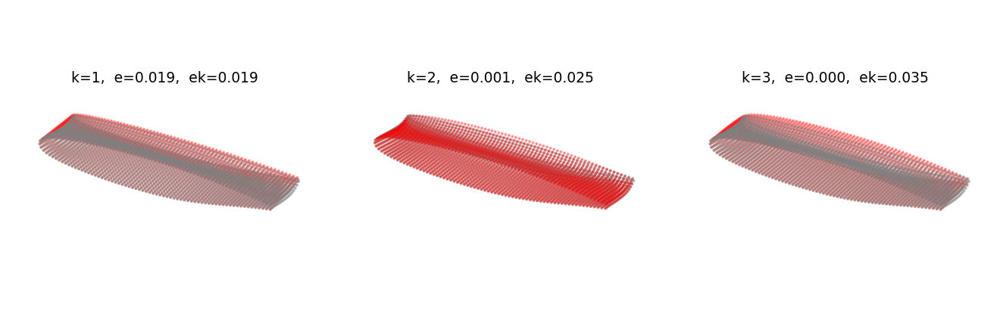

# Fairing Shape Decomposition


Decomposes the deformation field of a structural fairing surface mesh using **Singular Value Decomposition (SVD)**. Each SVD mode captures a dominant spatial pattern of deformation, enabling low-rank approximation and visualisation of the shape change.



---

## Method

Given a surface mesh with nodal coordinates **X** and nodal displacements **dX**, the deformation matrix is factorised as:

```
dX = U @ S @ V_T
```

The rank-k reconstruction is:

```
dX_k = U[:, :k] @ S[:k, :k] @ V_T[:k, :]
```

The script plots the **individual contribution** of each mode k = 1, 2, 3 alongside the original deformed shape, and reports the mean nodal reconstruction error for each.

---

## Requirements

- Python 3.9+
- numpy
- scipy
- matplotlib

Install dependencies into a virtual environment:

```powershell
python -m venv .venv
.\.venv\Scripts\Activate.ps1
pip install -r requirements.txt
```

---

## Usage

```powershell
python shape_decomposition.py -- <CASE_NAME> <FILE_ID>
```

| Argument    | Description                                              |
|-------------|----------------------------------------------------------|
| `CASE_NAME` | Subdirectory containing the case data (e.g. `Example`)  |
| `FILE_ID`   | Prefix of the data files to load (e.g. `0`)             |

**Example:**

```powershell
python shape_decomposition.py -- Example 0
```

---

## Input Data

The script expects two pickle files in `<CASE_NAME>/data/`:

| File                              | Contents                                                        |
|-----------------------------------|-----------------------------------------------------------------|
| `<FILE_ID>_fairing_mesh_data`     | Dict with keys `surface_nodes` and `surface_nodes_coords`      |
| `<FILE_ID>_fairing_data`          | `FairingData` object with attribute `surface_nodes_U` (dict mapping node number → list of displacement vectors per increment) |

---

## Project Structure

```
shape_decomposition.py   # Main script
Example/                 # Example case
│   data/                # Pickled mesh and fairing data
│   inp/                 # Abaqus input files
│   mesh/                # Mesh files
│   odb/                 # Abaqus output databases
│   input/               # JSON input parameter files
run_dir/                 # Working directory for runs
```

---

## Output

A matplotlib figure with three 3D scatter subplots, one per SVD mode:

- **Red** — rank-k SVD mode contribution
- **Grey** — original deformed shape
- Title shows mode index k, cumulative error e, and mode-only error ek

---

## License

This project is licensed under the [MIT License](LICENSE).
